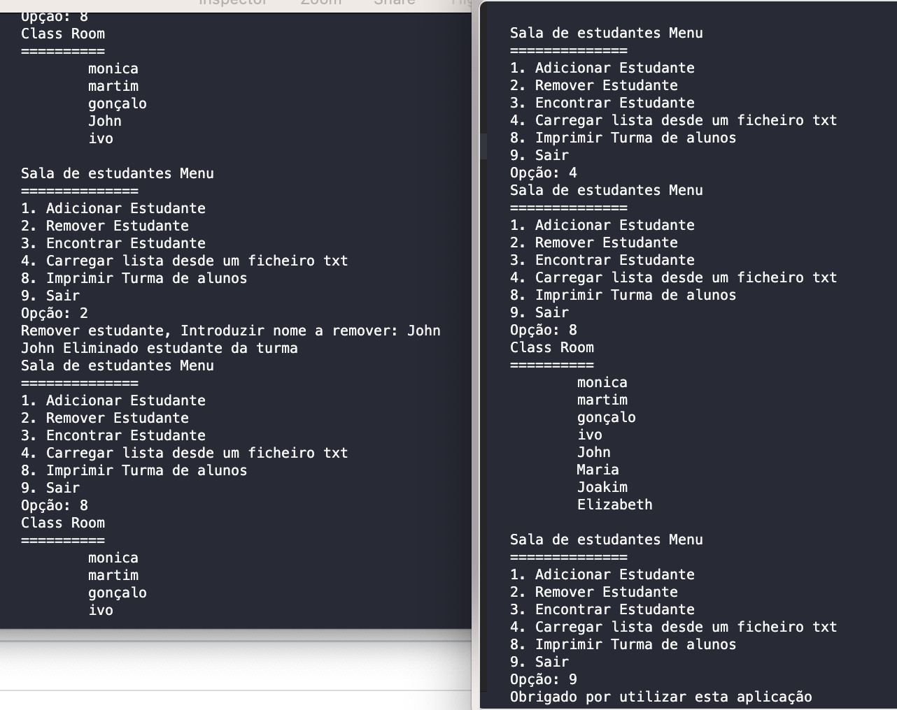

<h1 align="center">
    
</h1>

Programa em C++
    
Programa de alunos em C++17
Programa exemplo de boas practicas em C++17, exemplo de polimorfismo.

📌 Programa de cadastro de alunos em C++ # Student
------------------
O projeto foi feito em C++17.

The project was done with C++17.

Para compilar colocamos na pasta principal o ficheiro CMakeLists e no terminal escrevemos: 
 
<strong>cmake -S . -B out</strong> 
<strong>cmake --build out</strong> 
 
<strong>OU</strong> 
 
<strong>cmake -S . -B out</strong>  
<strong>cd out </strong> 
<strong>make</strong> 
Para Executar: 
<strong>out/student</strong>   
tambem na pasta src podemos compilar direto com o Gcc na linha de comandos escrevemos: 
<strong>g++ *.cpp -o pfoliog -std=c++17</strong> 
Para Executar dentro da pasta src:  
<strong>./student</strong> 
 

🔧 Tecnologias utilizadas:
------------------

- <strong>C++17</strong>
- <strong>Visual Studio Code</strong>
- <strong>QtCreator</strong>
- <strong>CMake</strong>
- <strong>Gcc</strong>
- <strong>MacOS</strong>

💬 Fale comigo
------------------
[*Entre em contato comigo*](https://www.linkedin.com/in/ivo-baptista-3712144/)

